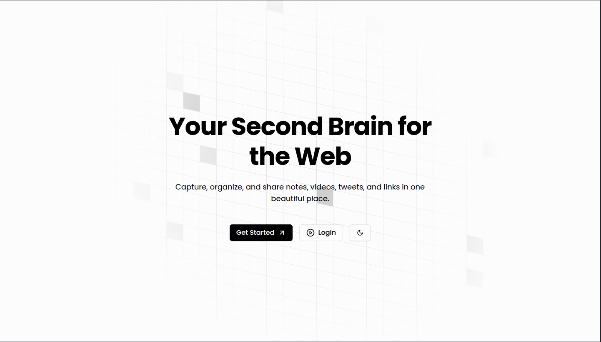
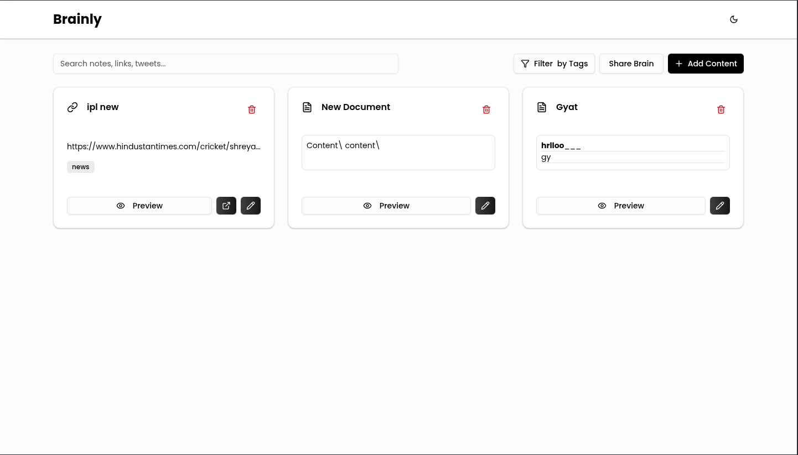

**Brainly**
=====================

**Project Overview**
-------------------

Brainly is a web application designed to help users organize and share their knowledge and learning resources. The application allows users to create, store, and share notes, links, and other types of content.
https://brainly-notes.vercel.app/
**Features**
------------

* User authentication and authorization
* Content creation and management (notes, links, etc.)
* Sharing and collaboration features
* Responsive design for a seamless user experience

**Getting Started**
-------------------

### Clone the Repository

`git clone git https://github.com/prikshitbuilds/Brainly.git`

### Navigate to the Project Directory

`cd brainly`

### Navigate to the Backend Directory

`cd backend`

### Install Dependencies

`npm install` or `yarn install`

### Start the Development Server

`npm run dev` or `yarn dev`

### Navigate to the Frontend Directory

`cd ../frontend`

### Install Dependencies

`npm install` or `yarn install`

### Start the Development Server

`npm run dev` or `yarn dev`

### Access the Application

Open your web browser to access the application. Go to mention the port number that is specified in the  frontend server.

**Screenshots**
--------------

### Home Page

### Dashboard

**Technologies Used**
----------------------

* Frontend: React, TypeScript, Tailwind CSS
* Backend: Node.js, Express.js, MongoDB
* Authentication: JSON Web Tokens (JWT)

**Contributing**
--------------

Contributions are welcome! If you'd like to contribute to the project, please fork the repository and submit a pull request with your changes.

**License**
----------

This project is licensed under the MIT License. See the LICENSE file for more information.

**Acknowledgments**
------------------

* [Bashar Khan](https://github.com/prikshitbuilds) - Project maintainer and contributor
